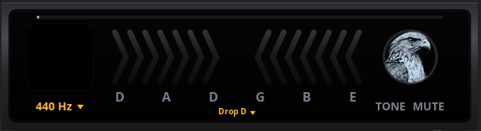
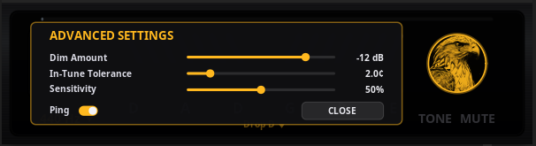

# The Mono Hawk

<p align="center"></p>

The Mono Hawk is a chromatic tuner for guitar and bass that runs on Linux as an LV2
plugin, with its own hardware-style interface. It tracks a single note to
**better than a cent**, down to a 5/6-string bass low B (~31 Hz), and pairs that
precision with a display you can read at a glance while you play.

## The front panel

<p align="center"></p>

Everything you need while tuning is on one face. From left to right:

- The **note window** (top left) shows the note you're playing — letter, sharp
  and octave. Sharps only, so E-flat reads as D#.
- The thin strip along the **top edge** is an input-level meter, so you can see
  signal is actually reaching the plugin.
- The **chevron meter** in the middle is how far off you are. The chevrons light
  inward from the edges: toward the left and **blue** when you're flat (tune
  up), toward the right and **amber** when you're sharp (tune down). The centre
  glows **white** when you land in tune, and a short pointer marks the exact
  spot. Colours are chosen to stay distinct for colour-blind eyes — flat and
  sharp are never red-versus-green.
- The **string row** underneath shows the open strings of the selected tuning,
  low string on the left. As you tune each string in, its letter latches lit and
  stays lit — a checklist you can work through in any order.
- The line under the row names the current tuning (`Drop D ▾`) and is the
  **tuning selector** — click it to open the menu.
- Bottom left, `440 Hz ▾` is the **A4 reference**; click to change it.
- On the right are **TONE** and **MUTE**, and the **hawk badge**. The badge
  opens the settings window.

## How it tunes

Play a string and the note window and chevron meter tell you the note and how
far off it is. The string row doubles as a checklist — each string's letter
lights up the moment you tune it in and stays lit, so you can work through the
whole instrument in any order. When the last one lands, the row and badge glow
briefly and then reset for the next instrument.

## Precision, and what "in tune" means

The detector works in two stages. A coarse stage picks the right note (and is
careful about octaves — low strings have a weak fundamental and overtones that
sit slightly sharp, an easy way to misread the pitch an octave too high). A fine
stage then tracks the phase of the signal to pull the cents down below a cent. On
a steady signal it resolves to about a tenth of a cent — strobe-tuner territory —
and it reaches down to a 5/6-string bass low B, around 31 Hz.

"In tune" is a small window around the target, not a single razor-thin point —
real strings drift and a perfectly strict tuner would never settle. That window
is the **In-Tune Tolerance** in the settings, two cents by default. Inside it,
the meter centre and the string letter read white. The measurement itself is far
finer than that window; the band just decides when to call it good.

## Settings

Click the hawk badge to open Advanced Settings.

<p align="center"></p>

- **Dim Amount** — how far the MUTE button pulls the output down, in dB. Set it
  deep if you want near-silence while you tune, or leave it shallow to keep
  playing quietly.
- **In-Tune Tolerance** — the half-width of the in-tune window, in cents
  (default 2.0). Smaller is stricter; larger is more forgiving.
- **Sensitivity** — how readily the detector trusts a weak or noisy signal.
  Turn it up for quiet pickups or a soft touch; turn it down if it's picking up
  room noise between notes.
- **Ping** — a short confirmation tone when a string lands in tune. Off by
  default; turn it on here if you like the audible cue.

## TONE and MUTE

**MUTE** dims the output by the Dim Amount, so you can tune without the dry note
blasting through your chain. The rest of the time the plugin is a clean
passthrough — bit-for-bit identical to the input when it isn't dimming — so it
can sit permanently on a track.

**TONE** plays a steady reference pitch for tuning by ear. With it on, the
plugin sounds a sine at the selected string's note; tap the note window to step
through the strings, and tap the small REF tag to move the tone up an octave
into a comfortable register.

## Tunings

Fifty of them, picked from a menu that's grouped by instrument and string count
rather than dumped in one long list:

- Guitar, six strings: Standard, the drops, the open (major) tunings, cross-note
  (minor) tunings, modal and suspended tunings like DADGAD, the whole lowered
  family from E-flat down to F, and the regular tunings (all-fourths,
  all-thirds, all-fifths, New Standard, Ostrich).
- Guitar, seven and eight strings: standard and drop.
- Bass, four/five/six strings, with drops.

If you don't know what something is tuned to, pick **Detect Tuning…** from the
menu and play the open strings one at a time — it listens and matches the set
against the table.

## Why there's no polyphonic mode

A polyphonic (all-strings-at-once) detector was prototyped for this project,
using the method described in Zhou, Reiss et al. (2009).¹ It is not included
here: polyphonic instrument tuning is covered by active patents — originating
with the TC Electronic PolyTune and now held by Music Tribe / Behringer — which
makes a freely-licensed, open-source polyphonic tuner untenable until those
patents expire (around 2030–2031) or are invalidated. So this release is
chromatic only. That, rather than any lack of a working method, is why a free and
open polyphonic guitar tuner doesn't exist on Linux today.

The method itself is written up in
[POLYPHONIC-METHOD.md](POLYPHONIC-METHOD.md) — the knowledge is free even though
the product can't be shipped.

> ¹ R. Zhou, J. D. Reiss, M. Mattavelli, and G. Zoia, "A Computationally
> Efficient Method for Polyphonic Pitch Estimation," *EURASIP Journal on Advances
> in Signal Processing*, vol. 2009, Article ID 729494. doi:10.1155/2009/729494

## Building it

You'll need a C++17 compiler, [Meson](https://mesonbuild.com/) with Ninja, and
the LV2, Cairo and Xlib development headers.

```sh
meson setup build
meson test -C build      # the detection test suites
ninja -C build           # core, CLI, and the LV2 plugin + GUI
```

## Installing it

Use the install script. It swaps the libraries in atomically — writes a temp
file and renames it over the old one — because copying over a `.so` while a host
has it memory-mapped will corrupt the running process and take the host down
with it.

```sh
./scripts/install.sh     # builds, then installs to ~/.lv2/themonohawk.lv2/
```

In a host like Ardour it shows up as **The Mono Hawk Tuner**. Put it on a **mono**
track and open its interface. If you rebuild in a way that changes the plugin's
port count, remove and re-add it so the host re-reads the ports.

## Without a DAW

There's a command-line tuner that reads raw 32-bit-float mono audio from stdin
and prints a live ASCII display:

```sh
arecord -f FLOAT_LE -c 1 -r 48000 -t raw | ./build/tools/hawk_cli
# or with PipeWire:
# pw-record --rate 48000 --channels 1 --format f32 - | ./build/tools/hawk_cli
```

## How this was made, and the license

This plugin was built mainly with **Claude Code** (Anthropic's AI coding agent),
working from my direction on the DSP, the design, and the testing. I can read
C++, but I have not reviewed every line by hand — so please treat it accordingly:

- **No warranty.** It works in my own testing, but it carries no guarantees of
  any kind.
- **No support.** This is a personal project; I can't promise help, fixes, or
  answers.
- **Help is welcome.** If you read code, spot bugs, or want to improve it, review
  and contributions are genuinely appreciated — that's a big part of why it's open.

Released under the **GNU General Public License v3.0 or later** — see
[`LICENSE`](LICENSE).

## Author

Made by **NL Sounds** — <https://github.com/NiLace> · nilace@nylarea.com
